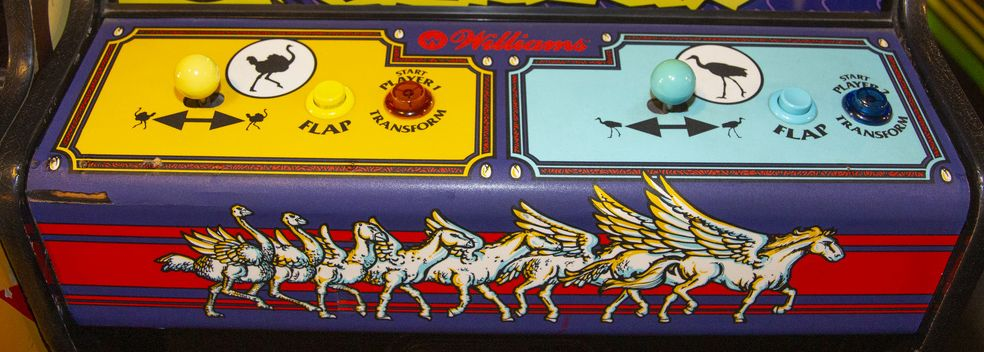

# [Arcade: Joust 2](https://en.wikipedia.org/wiki/Joust_2:_Survival_of_the_Fittest) for [MiSTer](https://mister-devel.github.io/MkDocs_MiSTer/)


Original core developed by [darfpga](https://github.com/darfpga)

Ported to MiSTer by [birdybro](https://github.com/birdybro)

## Description

This is a simulation model of the **Joust 2: Survival of the Fittest** hardware.

Original source is located in `doc/`

## Controls



| Name  | Description         |
| ----- | ------------------- |
| Flap  | You flap your wings |
| Left  | You go left         |
| Right | You go right        |
| Coin  | Put in a coin       |

There is a 1P Start and a 2P Start. These are also called "Transform" in-game.

The OSD menu includes a "Swap Joysticks" option to reverse Player 1 and Player 2 controls.

## Service Menu

Joust 2 had a peculiar system of DIPs. See the manual in `doc/` for the original source of the information.

When you press the "Advance" button in the OSD, this enables you to access the bookkeeping totals by then pressing "Auto Up" in the OSD. Currently the data in here is not saved to the MiSTer but that may come at a later time. 

If you want to change any options, then press "Auto Up" again to see the Game Adjustments menu. Here you use Player 1 right and left to move to whatever option you want to change and then use the Player 2 right and left inputs to modify the desired setting.

If you press "Advance" again, it will return to it's original state, but "Auto Up" now will cycle through various test programs that the arcade board used to have.

High Score reset is another internal button, and it makes the game pause for a second until the high score resets.

## Status

* Both revisions of Joust 2: Survival of the Fittest load and play fine.
* Regular sound effects play fine.
* 2 Player controls work.

## To-Do

* Pause not implemented.
* HiScore saving not implemented yet.
* Savestates not implemented yet.

## ROM Files Instructions

ROMs are not included! In order to use this arcade core, you will need to provide the correct ROM file yourself.

To simplify the process .mra files are provided in the releases folder, that specify the required ROMs with their checksums. The ROMs .zip filename refers to the corresponding file from the MAME project.

Please refer to [https://github.com/MiSTer-devel/Main_MiSTer/wiki/Arcade-Roms-and-MRA-files](https://github.com/MiSTer-devel/Main_MiSTer/wiki/Arcade-Roms-and-MRA-files) for information on how to setup and use the environment.

Quick reference for folders and file placement:

```
/_Arcade/<game name>.mra  
/_Arcade/cores/<game rbf>.rbf  
/_Arcade/mame/<mame rom>.zip  
/_Arcade/hbmame/<hbmame rom>.zip  
```
